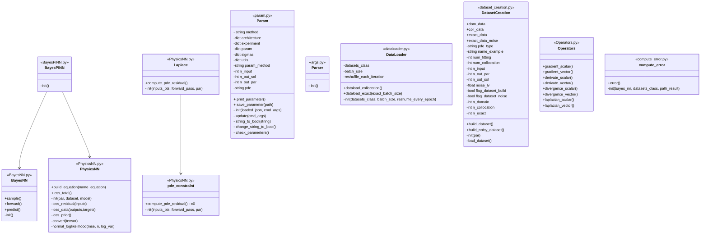

```mermaid
classDiagram
BayesPiNN --> BayesNN
BayesPiNN --> PhysicsNN
Laplace --> pde_constraint
class Param{
    <<param.py>>
    - string method
    -dict architecture
    -dict experiment
    -dict param
    -dict sigmas
    -dict utils
    -string param_method
    -int n_input
    -int n_out_sol
    -int n_out_par
    -string pde

    + print_parameter()
    + save_parameter(path)
    - init(loaded_json, cmd_args)
    - update(cmd_args)
    - string_to_bool(string)
    - change_string_to_bool()
    - check_parameters()
}
class Parser{
    <<args.py>>
    - init()
}
class DataLoader{
    <<dataloader.py>>
    -datasets_class
    -batch_size
    -reshuffle_each_iteration
    +dataload_collocation()
    +dataload_exact(exact_batch_size)
    -init(datasets_class, batch_size, reshuffle_every_epoch)
    
}
class DatasetCreation{
    <<dataset_creation.py>>
    +dom_data
    +coll_data
    +exact_data
    +exact_data_noise

    -string pde_type
    -string name_example
    -int num_fitting 
    -int num_collocation 
    -int n_input 
    -int n_out_par
    -int n_out_sol
    -float noise_lv
    -bool flag_dataset_build
    -bool flag_dataset_noise
    -int n_domain
    -int n_collocation
    -int n_exact

    +build_dataset()
    +build_noisy_dataset()
    -init(par)
    -load_dataset()

}
class BayesNN{
    <<BayesNN.py>>
    +sample()
    +forward()
    +predict()
    -init()
}

class BayesPiNN{
    <<BayesPiNN.py>>
    -init()
}

class Operators{
    <<Operators.py>>
    +gradient_scalar()
    +gradient_vector()
    +derivate_scalar()
    +derivate_vector()
    +divergence_scalar()
    +divergence_vector()
    +laplacian_scalar()
    +laplacian_vector()
}

class PhysicsNN{
    <<PhysicsNN.py>>
    +build_equation(name_equation)
    +loss_total()
    -init(par, dataset, model)
    -loss_residual(inputs)
    -loss_data(outputs,targets)
    -loss_prior()
    -convert(tensor)
    -normal_loglikelihood(mse, n, log_var)
}

class pde_constraint{
    <<PhysicsNN.py>>
    +compute_pde_residual()=0
    -init(inputs_pts, forward_pass, par)
}

class Laplace{
    <<PhysicsNN.py>>
    +compute_pde_residual()
    -init(inputs_pts, forward_pass, par)
}

class compute_error{
    <<compute_error.py>>
    +error()
    -init(bayes_nn, datasets_class, path_result)
}

```
