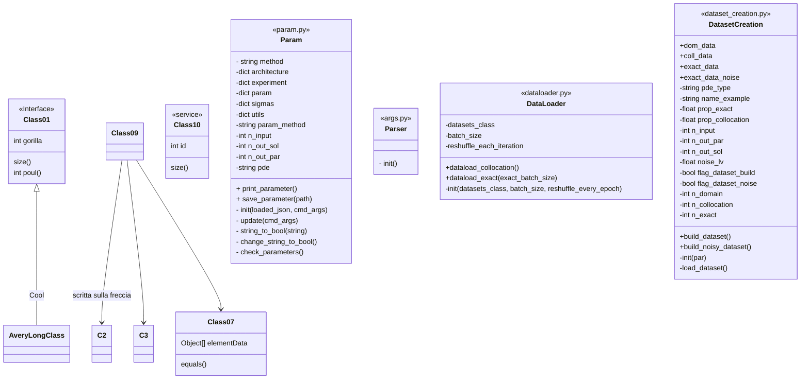

```mermaid
classDiagram
Class01 <|-- AveryLongClass : Cool
<<Interface>> Class01
Class09 --> C2 : scritta sulla freccia
Class09 --> C3
Class09 --> Class07
Class07 : equals()
Class07 : Object[] elementData
Class01 : size()
Class01 : int poul()
Class01 : int gorilla
class Class10 {
  <<service>>
  int id
  size()
}
class Param{
    <<param.py>>
    - string method
    -dict architecture
    -dict experiment
    -dict param
    -dict sigmas
    -dict utils
    -string param_method
    -int n_input
    -int n_out_sol
    -int n_out_par
    -string pde

    + print_parameter()
    + save_parameter(path)
    - init(loaded_json, cmd_args)
    - update(cmd_args)
    - string_to_bool(string)
    - change_string_to_bool()
    - check_parameters()
}
class Parser{
    <<args.py>>
    - init()
}
class DataLoader{
    <<dataloader.py>>
    -datasets_class
    -batch_size
    -reshuffle_each_iteration
    +dataload_collocation()
    +dataload_exact(exact_batch_size)
    -init(datasets_class, batch_size, reshuffle_every_epoch)
    
}
class DatasetCreation{
    <<dataset_creation.py>>
    +dom_data
    +coll_data
    +exact_data
    +exact_data_noise

    -string pde_type
    -string name_example
    -float prop_exact 
    -float prop_collocation 
    -int n_input 
    -int n_out_par
    -int n_out_sol
    -float noise_lv
    -bool flag_dataset_build
    -bool flag_dataset_noise
    -int n_domain
    -int n_collocation
    -int n_exact

    +build_dataset()
    +build_noisy_dataset()
    -init(par)
    -load_dataset()

}
```
