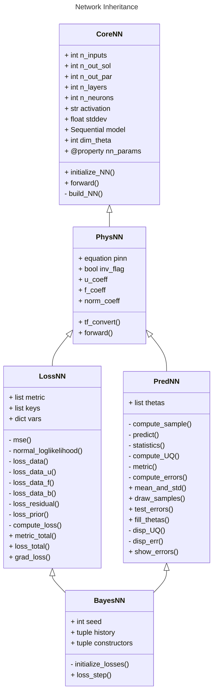

```mermaid
---
title: Network Inheritance
---
classDiagram
    CoreNN <|-- PhysNN
    PhysNN <|-- LossNN
    PhysNN <|-- PredNN
    LossNN <|-- BayesNN
    PredNN <|-- BayesNN
    class CoreNN{
        + int n_inputs
        + int n_out_sol 
        + int n_out_par
        + int n_layers
        + int n_neurons
        + str activation
        + float stddev
        + Sequential model
        + int dim_theta
        + @property nn_params
        + initialize_NN()
        + forward()
        - build_NN()
    }
    class PhysNN{
        + equation pinn
        + bool inv_flag
        + u_coeff
        + f_coeff
        + norm_coeff
        + tf_convert()
        + forward()
    }
    class LossNN{
        + list metric
        + list keys
        + dict vars
        - mse()
        - normal_loglikelihood()
        - loss_data()
        - loss_data_u()
        - loss_data_f()
        - loss_data_b()
        - loss_residual()
        - loss_prior()
        - compute_loss()
        + metric_total()
        + loss_total()
        + grad_loss()
    }
    class PredNN{
        + list thetas
        - compute_sample()
        - predict()
        - statistics()
        - compute_UQ()
        - metric()
        - compute_errors()
        + mean_and_std()
        + draw_samples()
        + test_errors()
        + fill_thetas()
        - disp_UQ()
        - disp_err()
        + show_errors()
    }
    class BayesNN{
        + int seed
        + tuple history
        + tuple constructors
        - initialize_losses()
        + loss_step()
    }
```